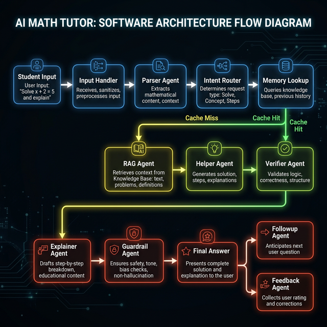
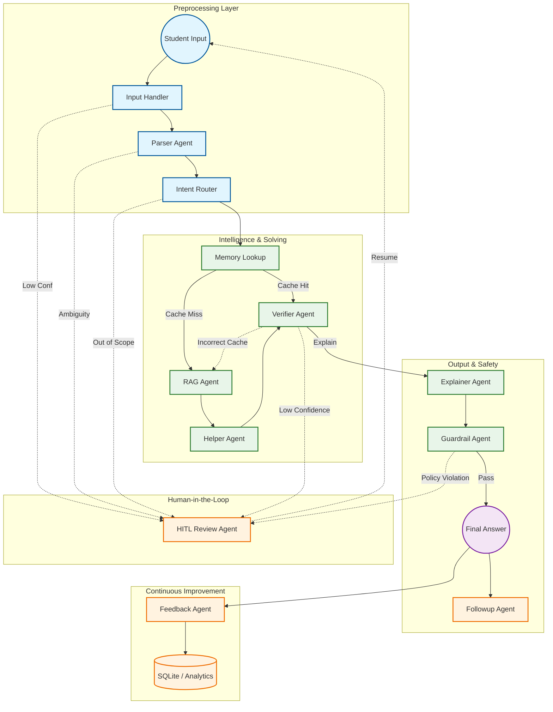
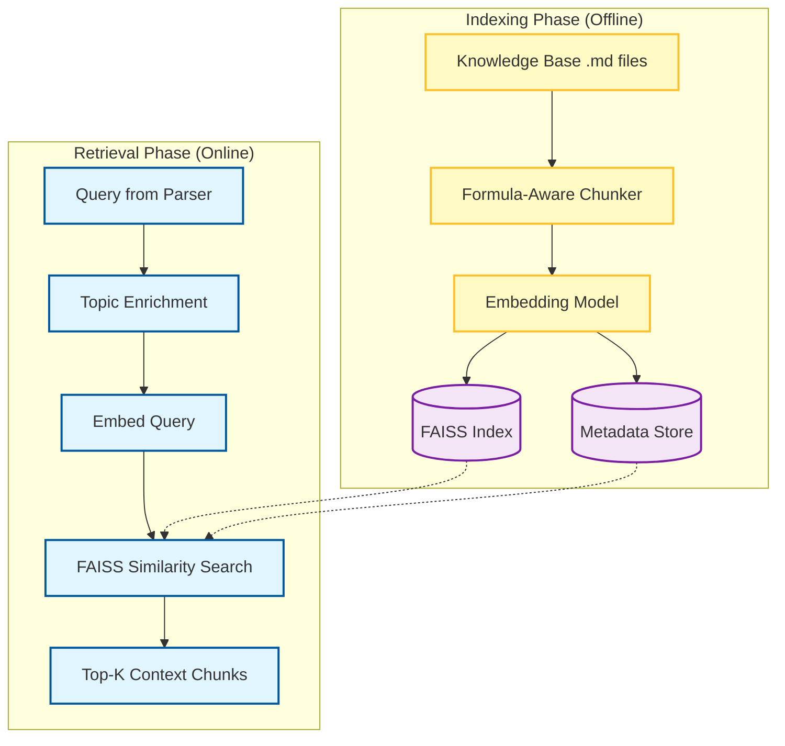

# 🧮 Math Mentor — AI Math Tutoring System

A production-grade, multimodal AI tutoring system that solves **JEE-style math problems** from text, image, or voice input. Built with a **multi-agent LangGraph pipeline**, RAG (Retrieval-Augmented Generation), Human-in-the-Loop (HITL), memory caching, and a Streamlit UI.

---

## 📐 Software Architecture



---

## 🔄 Agentic Pipeline (LangGraph)

The system uses a directed graph (`agents/graph.py`) to coordinate 9 specialized agents. Each agent can trigger a Human-in-the-Loop review if confidence is low.



---

## ✨ Key Features

### 🎤 Multimodal Input
| Mode | Technology | Details |
|:---|:---|:---|
| **Text** | Direct input | Typed math problems with 100% extraction confidence |
| **Image** | **Vision LLM (Llama 4 Maverick)** + Tesseract fallback | Clipboard paste, file upload, or camera capture. Vision LLM extracts LaTeX-accurate math notation |
| **Audio** | Faster-Whisper (small) | Real-time mic recording or file upload with math phrase normalization |

### 🧠 RAG (Retrieval-Augmented Generation)
- **FAISS** vector store with `all-MiniLM-L6-v2` embeddings
- **Formula-Aware Chunking**: LaTeX `$$...$$` blocks are never split during indexing
- **Topic Enrichment**: Queries are prefixed with detected topic for domain-specific retrieval
- **Top-K=1** retrieval strategy — in math, precision > recall

### 🔁 Memory & Caching
- **FAISS similarity search** for previously solved problems (similarity > 0.85 = cache hit)
- **Smart fallback**: If the verifier detects a cached answer is wrong, it auto-falls back to RAG
- **SQLite** persistence for solved problems, feedback, and HITL corrections

### 🖐️ Human-in-the-Loop (HITL)
Any agent can pause the pipeline and request human review:
- **Parser**: Ambiguous or incomplete problem statements
- **Intent Router**: Out-of-scope topics
- **Verifier**: Low mathematical confidence
- **Guardrail**: Safety or quality violations

Interactive features:
- 🧩 **Quiz Mode** — clickable suggestion buttons for quick corrections
- ✏️ **Edit & Continue** — manually correct extracted text
- 🤖 **Friendly Messages** — LLM-generated tutor-like explanations (not raw errors)

### 💬 Guided Follow-up
5 fixed follow-up categories after every solution:
1. 📐 Formulas/identities used
2. 📖 Detailed explanation
3. 🔗 Logical flow breakdown
4. 🔄 Similar problems from memory
5. ⚡ JEE shortcuts & tips

### 📣 Feedback System
- One-click sentiment (Helpful / Issues)
- Optional detailed comment with AI-powered analysis
- Feedback Agent categorizes issues for continuous improvement

---

## 🎭 Tiered Model Architecture

Optimized for Groq free-tier with automatic fallback & rotation on rate limits, decommissioned models, and errors.

| Agent | Model | Backups | Purpose |
|:---|:---|:---|:---|
| **Helper (Solver)** | `llama-4-maverick-17b` | `qwen3-32b`, `llama-3.3-70b` | Complex JEE math solving |
| **Verifier** | `gpt-oss-120b` | `compound`, `kimi-k2` | Deep reasoning & verification |
| **Parser / Guardrail** | `qwen3-32b` | `gpt-oss-20b`, `llama-3.1-8b` | Fast parsing & safety |
| **Feedback** | `compound-mini` | `gpt-oss-safeguard-20b` | Cost-effective analysis |
| **Vision OCR** | `llama-4-maverick-17b` | `llama-4-scout-17b` | Math image extraction |

---

## 📚 RAG Pipeline



---

## 🚀 Setup Instructions

```bash
# Clone the repository
git clone <repo-url>
cd AIPlanet_assignment

# Create virtual environment
python -m venv venv
source venv/bin/activate  # or venv\Scripts\activate on Windows

# Install dependencies
pip install -r requirements.txt

# Configure environment
cp .env.example .env
# Add your GROQ_API_KEY to .env

# Index the knowledge base
python -m rag.indexer

# Run the application
streamlit run app.py
```

## ⚙️ Environment Variables

| Variable | Description | Default |
|:---|:---|:---|
| `GROQ_API_KEY` | Groq API key for LLM inference | **Required** |
| `SQLITE_DB_PATH` | SQLite database path | `./memory/math_mentor.db` |
| `VECTOR_STORE_DIR` | FAISS index storage | `./vector_store` |
| `WHISPER_MODEL` | Faster-Whisper model size | `small` |
| `OCR_CONFIDENCE_THRESHOLD` | OCR HITL review threshold | `70` |
| `VERIFIER_CONFIDENCE_THRESHOLD` | Verification HITL threshold | `75` |

### How to get a free Groq API key
1. Sign up at [console.groq.com](https://console.groq.com)
2. Go to **API Keys** → **Create API Key**
3. Copy the key into your `.env` file

---

## 📁 Project Structure

```
AIPlanet_assignment/
├── app.py                          # Streamlit UI
├── agents/
│   ├── graph.py                    # LangGraph state machine
│   ├── state.py                    # Shared state definition
│   ├── groq_utils.py               # LLM fallback & rotation
│   ├── input_agent.py              # Input handler
│   ├── parser_agent.py             # Problem parser
│   ├── intent_router_agent.py      # Topic & scope router
│   ├── rag_agent.py                # RAG retrieval
│   ├── helper_agent.py             # Math solver
│   ├── verifier_agent.py           # Solution verification
│   ├── explainer_agent.py          # Step-by-step explanation
│   ├── guardrail_agent.py          # Safety & quality
│   ├── hitl_agent.py               # Human-in-the-loop
│   ├── followup_agent.py           # Follow-up conversations
│   └── feedback_agent.py           # Feedback analysis
├── input_handlers/
│   ├── ocr_handler.py              # Vision LLM + Tesseract OCR
│   └── asr_handler.py              # Whisper speech-to-text
├── memory/
│   ├── memory_store.py             # SQLite persistence
│   └── similarity_search.py        # FAISS similarity matching
├── rag/
│   ├── indexer.py                  # Knowledge base indexer
│   └── retriever.py                # Context retrieval
├── tools/
│   └── python_executor.py          # Sandboxed Python execution
├── knowledge_base/                 # Math reference documents
├── config/
│   └── settings.py                 # Model & config settings
├── docs/
│   └── pipeline_flow.png           # Architecture diagram
└── tests/                          # Pytest test suite
```

---

## 📊 Evaluation Summary

| Criterion | Implementation |
|:---|:---|
| **Multimodal Input** | Vision LLM OCR, Whisper ASR, clipboard paste, camera capture |
| **RAG** | FAISS + formula-aware chunking + topic enrichment |
| **Agent Orchestration** | 9 agents (Rule-Based, LLM, Hybrid) via LangGraph |
| **Memory/Caching** | FAISS similarity + SQLite audit trails |
| **HITL** | Any agent can trigger review with friendly messages & quiz mode |
| **Feedback Loop** | AI-categorized feedback → actionable improvement signals |
| **Model Resilience** | Auto-fallback on 429/400/404 errors across 3 backup models per tier |

---

> Built with ❤️ using LangGraph, Groq, FAISS, and Streamlit
