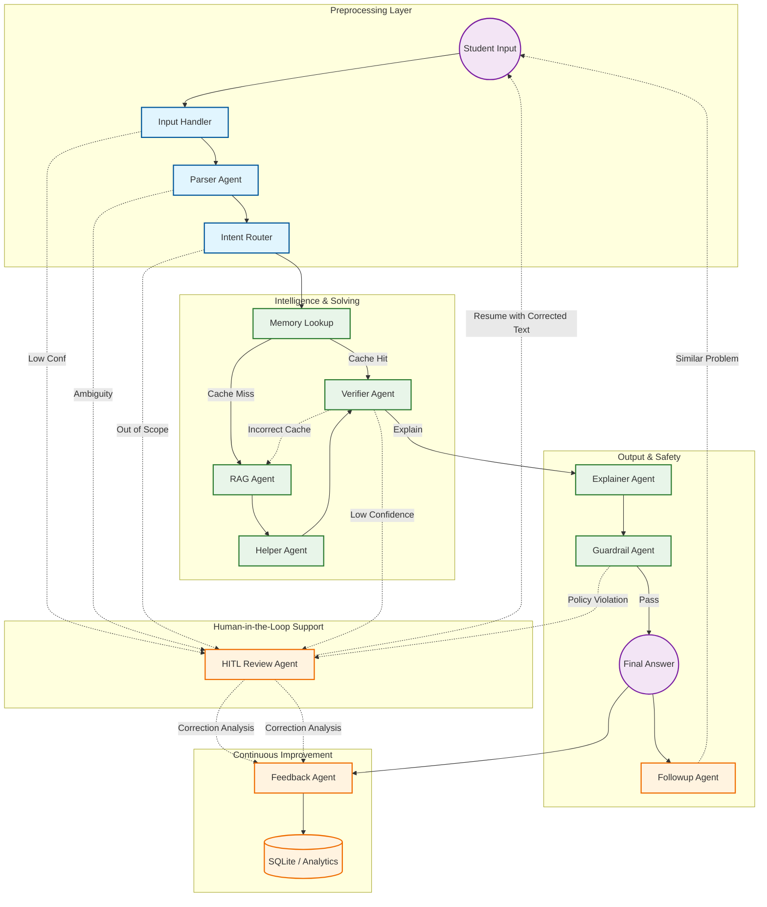

# Math Mentor Project Flow Walkthrough

This document outlines the end-to-end flow of the **Math Mentor** application, a JEE-style math problem solver powered by a multi-agent LangGraph system.

## 🏛️ High-Level Architecture

The project follows a modular, agentic architecture:
- **Frontend**: Streamlit-based UI for input (Text/Image/Audio) and interactive feedback.
- **Orchestration**: `LangGraph` (via `agents/graph.py`) manages state transitions and multi-agent coordination.
- **Processing**: Specialized agents for Parsing, Routing, RAG, Solving, Verifying, and Explaining.
- **Memory & Storage**: 
    - **FAISS**: For high-performance, local vector similarity search (problem-solution pairs and knowledge chunks).
    - **SQLite**: For persistent storage of solved problems, feedback, and HITL corrections.
- **Knowledge Base**: Indexed PDF/Markdown files for RAG.
- **Tiered Model Architecture**: Optimized usage of Groq's model ecosystem (LLama-3.3-70B, GPT-OSS-120B, etc.) to balance cost and accuracy.

## 🔄 Core Pipeline Flow (LangGraph)

The system uses a directed graph to process problems. Below is the visual representation of the logic defined in `agents/graph.py`.

## 📝 Step-by-Step Execution

### 1. Input Layer (`app.py` & `input_handler_agent.py`)
- User provides input via **Text**, **Image** (OCR), or **Audio** (Speech-to-Text).
- The `input_handler` extracts the raw text and assesses extraction confidence.

### 2. Pre-processing (`parser_agent.py` & `intent_router_agent.py`)
- **Parser**: Converts raw text into a structured JSON (problem text, variables, topic).
- **Intent Router**: A **Logic Node (Pure Python)** that validates if the problem topic is within the JEE syllabus.

### 3. Intelligence Retrieval & Solving

---

### 🧹 The "Two-Pass Cleaning" Logic

To ensure high accuracy, the system cleans input in two stages:

1.  **Pass 1: Rule-Based Mapping (Input Node)**:
    - **Speed**: Instant.
    - **Logic**: Simple string replacement (e.g., `"square root of"` $\rightarrow$ `"sqrt"`).
    - **Purpose**: Gives the user a "decent" version to confirm during HITL.

2.  **Pass 2: LLM-Based Refinement (Parser Node)**:
    - **Speed**: 1-2 seconds (Groq Llama-3).
    - **Logic**: Deep context understanding. It fixes complex OCR errors (like identifying if "V" is a variable or a radical symbol) and handles mathematical grammar.
    - **Purpose**: Generates the **Final Mathematical JSON** that the solver needs.

---

- **Memory Lookup**: Checks **FAISS** for previously solved similar problems.
    - **Strategy**: Uses **`top_k=1`** to find only the single best match. In math, "similar" is not enough—it must be the correct problem.
    - **Short-Circuit**: If a match is found (Similarity > 0.85), the system skips the RAG/Solver agents and goes straight to verification.
    - **RAG Fallback**: If the **Verifier** finds that the cached solution is incorrect for the current problem, the pipeline automatically falls back to the RAG Agent to solve it from scratch.

- **Verifier**: Audits the solution for mathematical correctness.
    - **Chain-of-Thought (CoT)**: Perform plug-back substitutions and domain checks.
    - **Fallback**: Automatically triggers RAG if a cached result fails.
- **Explainer (Master JEE Tutor)**: Generates high-quality LaTeX explanations with conceptual strategies and JEE shortcuts.
- **Guardrail (Safety & Quality)**: LLM-based final audit. Not only checks safety but also ensures the explanation is premium quality.
- **Feedback Agent**: Captures user sentiment and categorizes it to improve the RAG analytics.
- **Followup Agent**: Handles post-solution clarifications, generates expert "Next Step" suggestions, and retrieves similar problems from memory.

### 5. Human-In-The-Loop (HITL)
Any agent in the pipeline (Parser, Verifier, Guardrail, etc.) can trigger a review by setting `hitl_required=True`. This is typically used for:
- Low-confidence OCR or Speech-to-Text.
- Ambiguous or out-of-scope problem statements.
- Solutions that fail mathematical verification.
- Content that violates safety guardrails.

---

### 🧠 Semantic vs. Extraction Confidence

A common question is: **"Does typed text also need a confidence interval?"**

While the characters of typed text are always 100% "correctly read," the **meaning** of the text might still be wrong, incomplete, or out-of-scope. The system handles this through **Semantic Confidence** checks in later agents:

| Stage | Input Type | Confidence Check | HITL Trigger |
| :--- | :--- | :--- | :--- |
| **Input Handler** | Image/Audio | **Extraction Confidence**: "Did I read the characters/speech correctly?" | Score < 70% |
| **Input Handler** | **Text** | **None**: Characters are assumed to be 100% as typed. | Never |
| **Parser** | All | **Semantic Clarity**: "Is the math problem logically complete and parseable?" | `needs_clarification=True` |
| **Verifier** | All | **Mathematical Confidence**: "Is the derived answer correct?" | Score < 75% |
| **Intent Router** | All | **Scope Validation**: "Is this a math problem we can solve?" | `topic=unknown` |

**Example**: If you type *"Find the area of a circle with radius x"*, the **Input Handler** is 100% confident in the text. However, the **Parser Agent** will detect that the value of `x` is missing and trigger HITL, asking you to provide the missing information.

---

When triggered:
- The pipeline **pauses**.
- The user is prompted in Streamlit to correct or approve the state.

### 🔄 The "Smart Resume" Logic
A common question is: *"If I provide a clarification in HITL, does the AI start from scratch?"*
- **The Answer**: No. The system uses **Context-Aware Re-entry**.
- **The Flow**: When you click "Approve" or a "Suggestion", the pipeline re-runs the **Input Handler**. 
- **The Optimization**: The Input Handler sees that you've already provided a corrected `extracted_text`. It **skips** the OCR/Speech extraction and passes your new text directly to the **Parser**.
- **Result**: Your "clarification" becomes the new reality for the AI, allowing it to solve the problem exactly as you intended.

To match the experience of premium assistants like GPT-4 or Claude, Math Mentor doesn't just show "Error" messages. It provides **Interactive Coaching**:
1. **Conversational Messages**: LLM-driven clarifications that sound like a patient tutor.
2. **Quiz Mode**: If an input is messy, the system suggests interpretation **clickable buttons**.
3. **One-Click Resume**: Clicking a suggestion instantly updates the problem and resumes the pipeline.

### 🗣️ Conversational Feedback Agent
The system now includes an **Intelligent Feedback Loop**:
1. **Analytic Feedback**: Students can type natural language comments (e.g., *"Step 2 was confusing"*).
2. **AI Analysis**: A **Feedback Agent** categorizes the comment (*Technical*, *Explanation*, *Stylistic*) and determines if it’s *Actionable*.
3. **Loop Closure**: Actionable feedback is highlighted in the **RAG Analytics Dashboard**, allowing developers to close knowledge gaps instantly.

---

## 🎭 Tiered Model Architecture (Groq Optimization)

To optimize for accuracy and the Groq free-tier limits, we use a specialized "Tiered" model strategy:

| Agent / Phase | Task Complexity | Model Allocated | Role Description |
| :--- | :--- | :--- | :--- |
| **Parser Agent** | Medium | `FAST_MODEL` (Qwen3-32B) | Processes messy text into perfect JSON structures. |
| **Intent Router** | Low | **Logic Node (Python)** | Simple classification: Is this a JEE math problem? |
| **Helper Agent** | **VERY High** | `MATH_MODEL` (Llama-4-Maverick-17B) | High-precision JEE math solving with tool execution. |
| **Verifier Agent** | **CRITICAL** | `REASONING_MODEL` (GPT-OSS-120B) | "Devil's Advocate" — maximum reasoning to catch errors. |
| **Explainer Agent** | High | `MATH_MODEL` (Llama-4-Maverick-17B) | Generates master-level LaTeX tutorials. |
| **Guardrail Agent** | Medium | `FAST_MODEL` (Qwen3-32B) | Final quality & safety audit. |
| **Followup Agent** | Medium | `FAST_MODEL` (Qwen3-32B) | Handles conversational depth and learning suggestions. |
| **Feedback Agent** | Low | `MINI_MODEL` (Compound-Mini) | Cost-effective analytical processing of user comments. |
| **Vision OCR** | Medium | Llama-4-Maverick / Scout (Vision) | Extracts math notation from images with LaTeX output. |

---

## 📚 RAG Pipeline Flow
The Retrieval-Augmented Generation (RAG) system consists of an offline indexing phase and an online retrieval phase, specifically optimized for mathematical formulas.

```mermaid
graph TD
    classDef indexing fill:#fff9c4,stroke:#fbc02d,stroke-width:2px;
    classDef retrieval fill:#e1f5fe,stroke:#01579b,stroke-width:2px;
    classDef storage fill:#f3e5f5,stroke:#7b1fa2,stroke-width:2px;

    subgraph "Indexing Phase (Offline)"
        Docs[Knowledge Base .md files]:::indexing --> CH[Formula-Aware Chunker]:::indexing
        CH --> EM[Embedding Model]:::indexing
        EM --> FI[(FAISS Index)]:::storage
        EM --> MF[(Metadata Store)]:::storage
    end

    subgraph "Retrieval Phase (Online)"
        Q[Query]:::retrieval --> EN[Topic Enrichment]:::retrieval
        EN --> QEM[Embed Query]:::retrieval
        QEM --> Search[FAISS Search]:::retrieval
        FI -.-> Search
        MF -.-> Search
        Search --> Context[Top-K Context Chunks]:::retrieval
    end
```

### Key Technical Details:
- **Formula-Aware Chunking**: Uses regex to identify `$$...$$` blocks, ensuring LaTeX formulas are never split in half during retrieval.
- **Topic Enrichment**: The query is prefixed with the detected topic (e.g., `calculus: ...`) to guide the vector search toward the correct domain.
- **Metadata Association**: Each vector is linked to its original source file and page, providing clear citations in the final answer.

## 📈 The RAG Improvement Loop

To continuously improve the system, we’ve implemented a feedback loop that identifies "knowledge gaps" in the RAG:

1.  **Failure Tracking**: Every solve attempt is saved in SQLite. Problems with `is_correct = False` or negative user feedback are automatically "flagged."
2.  **RAG Analytics Dashboard**: A specialized view in the Streamlit **Sidebar** allows administrators to see exactly which questions the AI is failing to solve.
3.  **Formula-Aware Indexing**: When adding new math formulas to fix these gaps, the system uses a custom `chunk_text` logic in `rag/indexer.py` that protects mathematical blocks ($$ ... $$) from being split, ensuring the solver retrieves the full formula context.

---

## 🔍 Example Trace: Solving a Quadratic Equation

Let's follow a problem: **"Solve $x^2 - 5x + 6 = 0$"** uploaded as an **Image**.

1.  **Input Handler**: OCR extracts the text from the image.
2.  **Parser**: Converts text into structured JSON with LaTeX.
3.  **Intent Router**: Confirms the problem is in-scope for JEE.
4.  **Memory Lookup**: Checks for exact matches (Top-K=1).
5.  **RAG/Helper**: (If Cache Miss) Solve using SymPy/Python tools.
6.  **Verifier**: Verifies the answer. If the cache was wrong, it restarts at RAG.
7.  **Explainer**: Generates a "Master Tutor" explanation.
8.  **Guardrail**: LLM confirms the output is safe and high-quality.
9.  **Feedback**: User provides natural language feedback (e.g. "Too complex").
10. **Improvement**: Feedback Agent tags the issue for RAG improvement.

### 6. Vision LLM OCR & Heuristic Fallback
The image extraction pipeline now uses a **two-tier approach** in `input_handlers/ocr_handler.py`:
- **Primary: Vision LLM** (Llama 4 Maverick via Groq) — directly reads math images and outputs LaTeX-accurate notation (√, ∫, fractions, exponents).
- **Fallback: Tesseract + Heuristic Cleanup** — used only if the vision API fails. Context-aware regex prevents false positives (e.g., "Volume" is not converted to "sqrtolume").
- **Input Methods**: Clipboard paste, file upload, and camera capture.

## 📁 Key File Map

| Component | Path | Description |
| :--- | :--- | :--- |
| **Logic** | [agents/graph.py](file:///Users/pridhvi/Desktop/AIPlanet_assignment/agents/graph.py) | Defines the LangGraph state machine. |
| **UI** | [app.py](file:///Users/pridhvi/Desktop/AIPlanet_assignment/app.py) | Streamlit interface and session management. |
| **Agents** | [agents/](file:///Users/pridhvi/Desktop/AIPlanet_assignment/agents/) | Implementation of individual specialized agents. |
| **Database** | [memory/](file:///Users/pridhvi/Desktop/AIPlanet_assignment/memory/) | Similarity search and SQLite persistence. |
| **RAG** | [rag/](file:///Users/pridhvi/Desktop/AIPlanet_assignment/rag/) | Indexing and retrieval logic. |

---
*Created by Math Mentor Documentation Agent*
